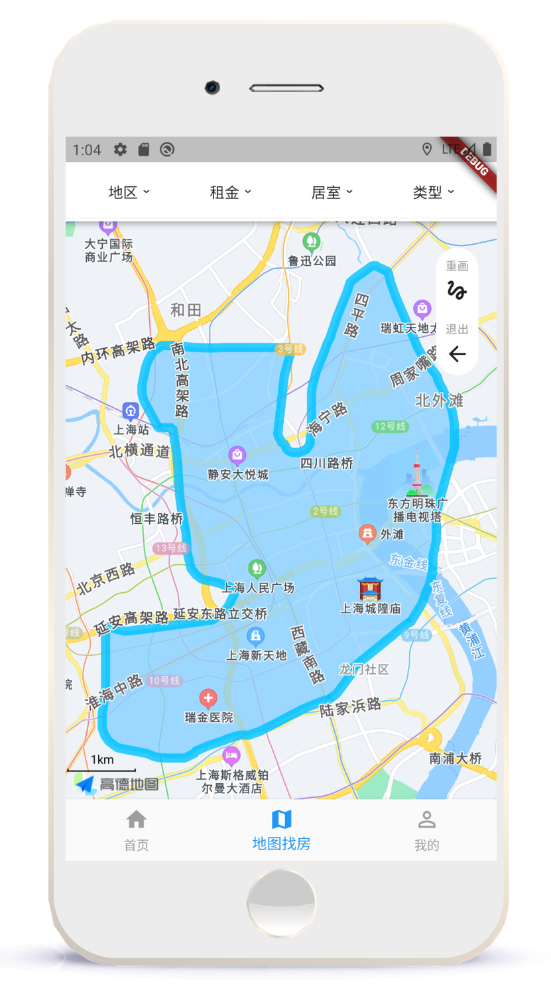
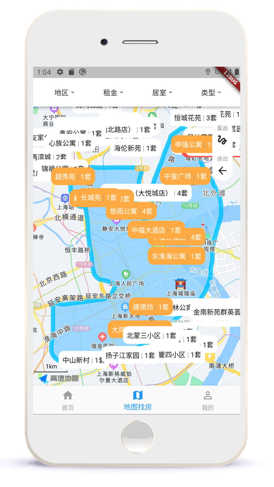
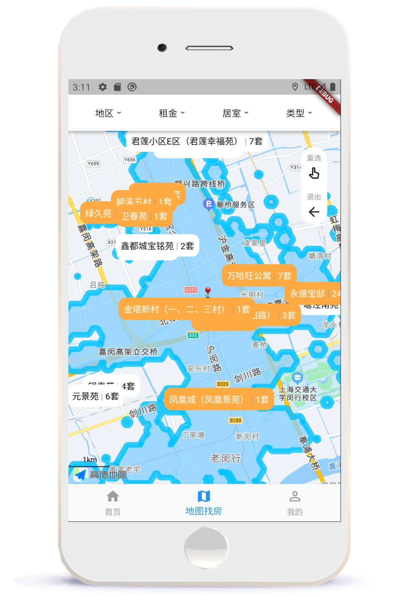
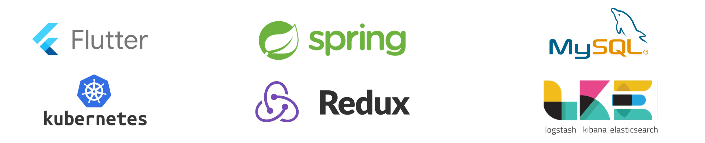

# Rent Now - House Finding on Map App

## Introduction

Rent Now is a house finding App based on Amap that can display available houses on map with multi-conditions filtering, supports searching by one-hour commuting circle, drawing area on map for intended result, integrated with route planning between spots.

## Core Features

- **House List Recommendation:** endless list for house recommendation.

  

- **Map-based House Hunting:** display housing listings in the vicinity of the current location on the map, with support for dragging the map to view listings in different areas.

  
    
  To enhance rendering performance, we implement lazy loading within the visual range. We rewrite the map's OnCameraChangeListener to obtain the latest visual boundaries of the map area, prioritize loading housing markers within this rectangular latitude and longitude range, and do not load markers from more distant areas.

- **Circle Drawing House Hunting:** displays listings within a user-defined area on the map after drawing.

  

  

  Identifies user gestures and touchpoints using the Gesture Detector component, calculates positions based on the Mercator projection principle, and displays the corresponding points on the map, connecting them to form smooth curves.

- **Commute-based House Hunting:** offers listings within a one-hour commute circle.

  

  Enables users to drag and drop to choose their starting point, filter housing options within a one-hour commute radius, and apply additional filtering criteria for a combined search.

- **Filtering by Conditions:** supports filtering listings by multiple conditions such as rent, rooms, and administrative areas.

- **House Recommendation:** intelligent recommendations of listings based on user location, favorites and search history.

  

  Uses geocode matching to perform nearby housing searches, significantly enhancing performance compared to direct distance calculations; combines user's historical filtering preferences for tailored recommendations, precisely meeting their needs.

- **Property Navigation:** plans multiple travel routes from a starting point to the listing using four different modes of transportation.

- **Property Searching:** search feature includes prompts for neighborhood names and administrative divisions.

- **Aggregation of Housing Points:** achieves aggregation of housing points on the map within a certain zoom range.

- **Multi-platform Supports:** ensures compatibility with clients of various resolutions/sizes and even allows for direct use in web browsers.

  

  The Flutter framework used in the frontend employs a rendering engine to draw the UI, instead of relying on native controls of the system platform, ensuring UI consistency across different platforms.

## Architecture and Technology Stack

The App applied Redux for state management in Flutter front-end, adopted Microservices architecture and deployed Kubernetes cluster for Spring back-end, followed MVC pattern and component-based development, employed CI/CD using GitLab.



## Academic Integrity WARNING

If you are currently learning SJTU SE2320 course, please be aware that the code has been added to the checking library of SJTU SE, so please do not copy it.

## Getting Started

This project is a starting point for a Flutter application.

A few resources to get you started if this is your first Flutter project:

- [Lab: Write your first Flutter app](https://docs.flutter.dev/get-started/codelab)
- [Cookbook: Useful Flutter samples](https://docs.flutter.dev/cookbook)

For help getting started with Flutter development, view the
[online documentation](https://docs.flutter.dev/), which offers tutorials,
samples, guidance on mobile development, and a full API reference.

## File Structure

```
- android
- ios
- assets
    - json
    - icon
- lib
    - routes
    - widgets
    - common
    - main.dart
- test
    - demo
```
